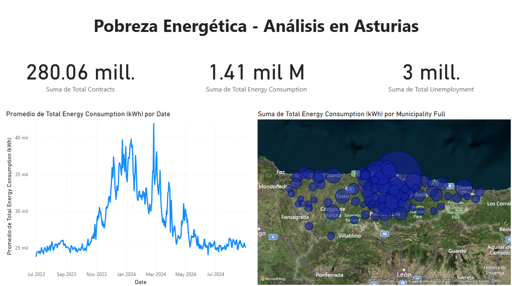

# Energy Poverty Risk Analysis

## Overview

This project analyzes socioeconomic and demographic indicators to identify populations and regions at higher risk of energy poverty.
The goal is to explore whether specific cohorts or geographic areas exhibit systematically higher vulnerability, using open datasets and exploratory data analysis techniques.

The project was developed as part of a university data science course, with an emphasis on data interpretation, visualization, and policy-relevant insights rather than predictive modeling.

## Motivation

Energy poverty is a growing social and economic concern, particularly in urban areas where income inequality, housing quality, and energy costs intersect.
Understanding which populations are most affected is essential for designing targeted interventions and public policies.

This analysis aims to provide data-driven insight into energy poverty risk factors using publicly available data.

## Data

The analysis is based on open socioeconomic datasets, including indicators related to:
- Income and employment
- Housing characteristics
- Household composition
- Energy expenditure or proxies

The data was cleaned, merged, and standardized prior to analysis.

> Note: The analysis focuses on aggregated data; no individual-level or sensitive data is used.

## Methodology

The workflow followed these steps:

1. **Data cleaning and preprocessing**
   - Handling missing values
   - Standardizing socioeconomic indicators
   - Filtering by geographic area and cohort

2. **Exploratory Data Analysis (EDA)**
   - Distribution analysis of key variables
   - Comparison across regions and population groups
   - Identification of potential risk patterns

3. **Visualization and Reporting**
   - Key findings were summarized and communicated through an interactive Power BI dashboard.

## Results and Insights

The analysis revealed that energy poverty risk is not uniformly distributed and tends to correlate with specific socioeconomic factors.
Certain regions and population cohorts consistently exhibit higher vulnerability across multiple indicators.

### Dashboard Overview

The final results were presented through a Power BI dashboard, allowing interactive exploration of:
- Regional comparisons
- Cohort-level risk indicators
- Relationships between income, housing, and energy-related variables

*(Screenshot representative of the final analytics dashboard)*

## Limitations and Future Work

- The analysis relies on aggregated data, which limits individual-level inference.
- Additional temporal data could help identify trends over time.
- Incorporating energy price dynamics or building efficiency data could strengthen conclusions.

## Tech Stack

- Python (pandas, numpy, matplotlib)
- Jupyter Notebook
- Power BI (for interactive visualization)
